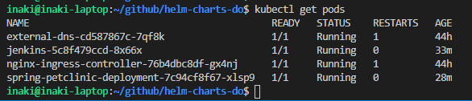
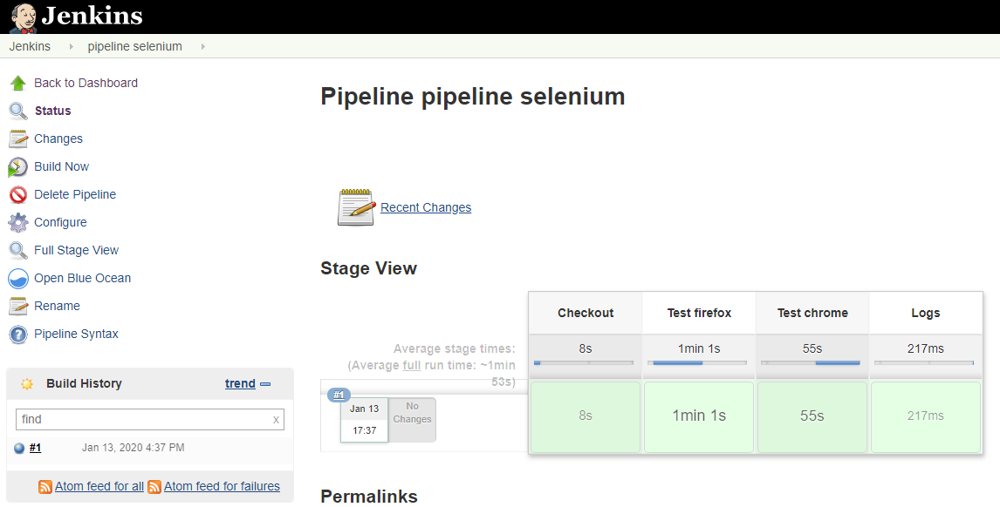
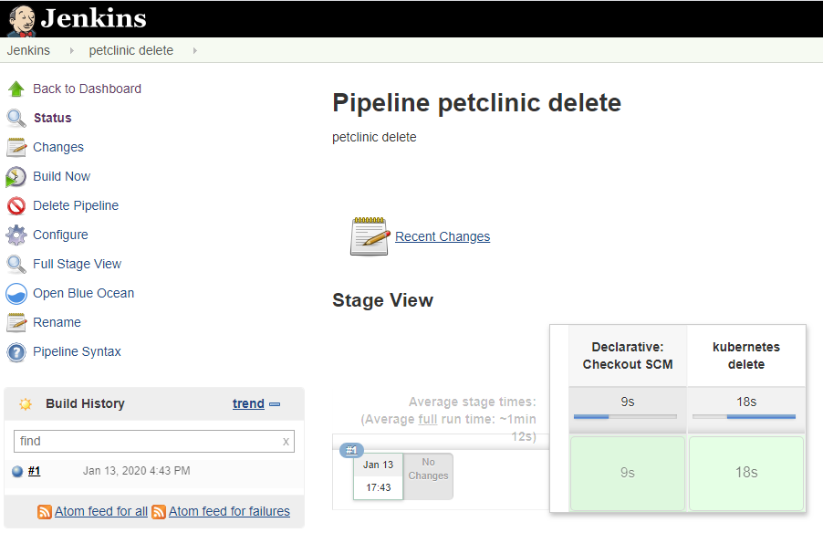

# Jenkins on Kubernetes with ephemeral slaves and 100% Configuration as Code. Demo deployment of spring-petclinic (monolithic)

## All the Jenkins Jobs & Jenkins configurations are setup via ‘Jenkins as Code’ plugin 
We don’t have to apply any other manual configuration after deploying jenkins with helm:

## Ephemeral jenkins slaves are triggered when running a jenkins job. These containerized slaves can run docker commands like “docker build”

 
 
 
 
 